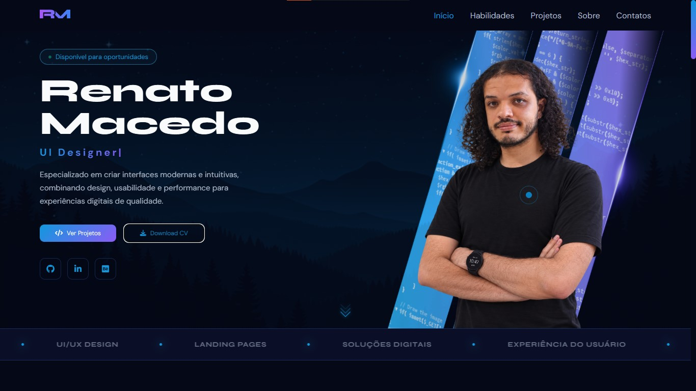
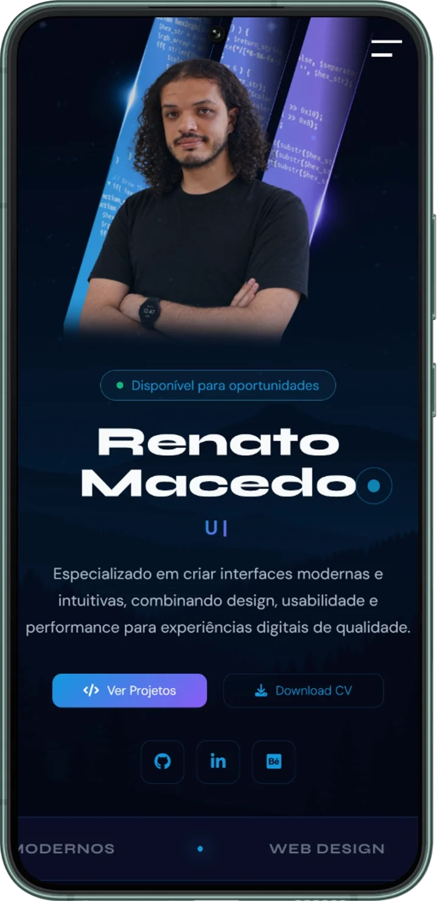

# 💼 Portfólio Pessoal

Meu portfólio como **Desenvolvedor Front-end**, desenvolvido para apresentar meus projetos, habilidades e trajetória profissional. O objetivo é demonstrar conhecimentos em desenvolvimento web, design de interfaces e boas práticas de programação.

---

## 🚀 Tecnologias Utilizadas

* HTML5
* CSS3
* JavaScript
* Git & GitHub
* Figma

---

## ✨ Funcionalidades

* Layout moderno e responsivo
* Interface intuitiva
* Animações suaves
* Seção de projetos
* Seção de habilidades
* Contato direto via WhatsApp
* Download do currículo em PDF

---

## 📸 Preview

### Desktop

<p align="center">
  
</p>


### Mobile

<p align="center">
  
</p>

---

## 📂 Estrutura do Projeto

```text
portfolio/
├── assets/
│   ├── css/
│   ├── image/
│   ├── js/
│   └── icons/
├── index.html
└── README.md
```

---

## 🌐 Acesse o Projeto

* **Site:** *(adicione o link do seu portfólio)*
* **Repositório:** *(adicione o link do GitHub)*

---

## 👨‍💻 Autor

**Renato Macedo**

* GitHub: https://github.com/RenatoMacedoA
* LinkedIn: https://www.linkedin.com/in/renatomacedoa/
* E-mail: [renatomacedonato@gmail.com](mailto:renatomacedonato@gmail.com)

---

## 📄 Licença

Este projeto está licenciado sob a licença MIT. Sinta-se à vontade para estudar o código e utilizá-lo como referência para aprendizado.
